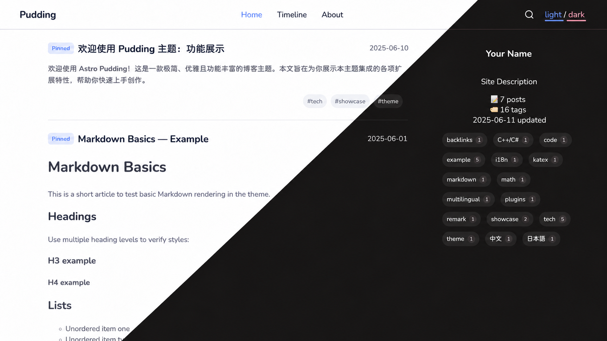
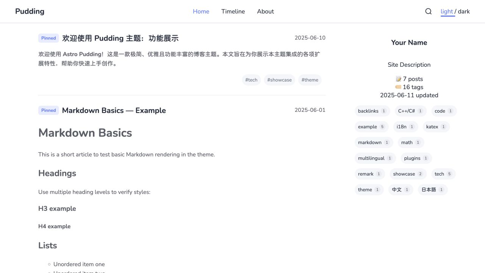
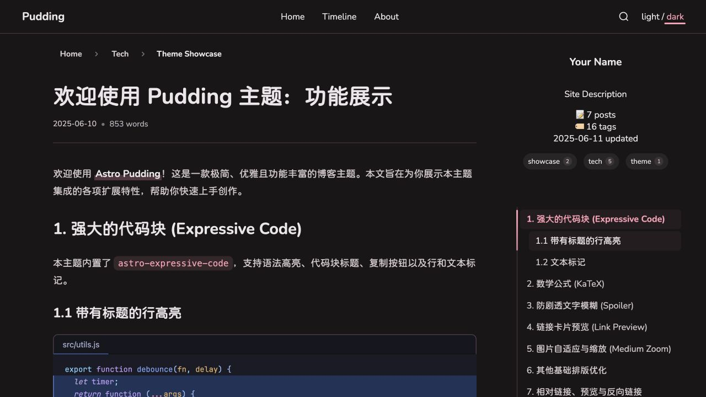

# Astro Theme Pudding

[简体中文](README.zh-CN.md) · [Demo](https://huamurui.github.io/pudding/)

Pudding is a static Markdown blog theme built with Astro 7 and Svelte 5. It includes light and dark themes, responsive post lists, a timeline, search, directory navigation, tag pages, backlinks, hover previews, image zoom, math, and Expressive Code. RSS, a sitemap, and structured metadata are generated during the build. Comments are optional through giscus.

## Screenshots

Captured from this repository's demo content. The same home page appears in light mode at the upper left and dark mode at the lower right, with the dividing line tilted slightly counterclockwise.



<details>
<summary>Desktop home, dark article, and mobile layout</summary>






</details>

## Get started

Use **Node.js 22.12.0 or newer** and **pnpm 12.8.1**. The repository's `.nvmrc` selects Node 22, and `packageManager` pins pnpm.

```sh
git clone https://github.com/huamurui/pudding.git
cd pudding
# If you use nvm: nvm install && nvm use
npm install --global pnpm@12.8.1
pnpm install --frozen-lockfile
pnpm dev
```

With the supplied configuration, open `http://localhost:4321/pudding/`. Before publishing, edit the site configuration and replace the sample posts, About page, and links.

| Command | Purpose |
| --- | --- |
| `pnpm generate` | Generate `.cache/backlinks.json` from published Markdown posts. |
| `pnpm dev` | Generate backlinks and start the development server. |
| `pnpm check` | Generate backlinks, then check Astro and Svelte types. |
| `pnpm test` | Run the regression tests. |
| `pnpm lint` | Check source code with ESLint. |
| `pnpm lint:fix` | Apply available ESLint fixes. |
| `pnpm build` | Generate backlinks and build the static site into `dist/`. |
| `pnpm preview` | Serve the existing production build locally. |
| `pnpm build:infos` | Alias for `pnpm build`. |

After changing article links during development, run `pnpm generate` and restart the dev server to refresh backlinks. `pnpm preview` requires a completed build; it does not rebuild the site.

## Configure your site

Edit `src/config/site.config.ts`. Keep the existing object and update its fields: site name, description, author, navigation, social links, theme colors, locale, and comments.

| Field | Role | Project Pages example |
| --- | --- | --- |
| `site` | Public origin passed to Astro for absolute URLs. | `https://YOUR_USER.github.io` |
| `base` | Path prefix for local routes and assets; `''` at the domain root. | `/pudding` |
| `url` | Full public site address; RSS uses it as a compatibility fallback after Astro's `site` and the configured `site`. | `https://YOUR_USER.github.io/pudding/` |

For a GitHub repository named `pudding`:

```ts
site: 'https://YOUR_USER.github.io',
base: '/pudding',
url: 'https://YOUR_USER.github.io/pudding/',
```

For a user site (`YOUR_USER.github.io`) or a custom domain hosted at its root:

```ts
site: 'https://YOUR_USER.github.io',
base: '',
url: 'https://YOUR_USER.github.io/',
```

Replace the hostname in the applicable fields for a custom domain. A repository rename also requires updating `base` and `url`. Do not put `/pudding` in both `site` and `base`.

Configuration links such as `./about`, `/rss.xml`, and `./sitemap.xml` pass through the theme's base-aware URL helper. In Astro/Svelte components, use `buildUrl`, `getPostUrl`, and `getTagUrl` from `src/utils/helpers.ts`. Raw HTML links in Markdown are used as written: `/images/example.png` points to the domain root even when `base` is `/pudding`.

Choose `en-US` or `zh-CN` with `locale`. Interface translations live in `src/config/i18n.config.ts`; this setting does not change the language of articles.

## Write posts

Add `.md` files under `src/posts/`. MDX is not configured. Only `title` and `date` are required:

```yaml
---
title: "My first post"
date: "2026-01-01T09:00:00+08:00"
description: "A short description for metadata and RSS."
tags: ["Astro", "C++/C#", "中文"]
author: "Your Name"
updated: "2026-01-02T10:30:00+08:00"
pinned: false
draft: false
slug: "notes/my-first-post"
image:
  url: "https://images.unsplash.com/photo-1579546929518-9e396f3cc809?w=1200&q=80"
  alt: "A colorful gradient"
---
```

| Field | Behavior |
| --- | --- |
| `title` | Required nonempty title. |
| `date` | Required date or datetime. `2026-01-01` is valid; quote datetimes and include a timezone. Sorting uses the full timestamp; the displayed date is its UTC calendar date. |
| `description` | Optional plain description. Metadata and RSS use an excerpt when absent; home cards use a rich excerpt from the body. |
| `tags` | Optional list. Labels are trimmed, Unicode-normalized, and deduplicated; empty labels are invalid. |
| `author` | Optional author override for article metadata. |
| `updated` | Optional modification date for structured metadata. |
| `pinned` | Defaults to `false`; pinned posts appear first on the home page. |
| `draft` | Defaults to `false`; drafts are excluded from public routes, lists, search, tags, feeds, previews, and backlinks. |
| `slug` | Optional article ID override; see path rules below. |
| `image` | Optional banner with an absolute URL and optional `alt`, also displayed as its caption. Its remote host must be allowed in `astro.config.mjs` for Astro's banner image pipeline. |
| `url` | Optional canonical override. Use an absolute HTTP(S) URL when republishing; it does not move the local article route. |

Put `<!-- more -->` after the part of the body to show in home cards. Without it, the first paragraph or list is used.

### Paths, directories, and tags

`src/posts/tech/my-post.md` gets the ID `tech/my-post`, served at `/pudding/posts/tech/my-post/` with the supplied base. Default path segments use GitHub-style slugging. A nested `index.md` represents its directory: `tech/index.md` gets the ID `tech`. A root `index.md` keeps the ID `index`.

`slug` replaces the entire ID, including directory segments. Use a nonempty relative path such as `guides/getting-started`, preferably with lowercase letters, digits, Unicode, and hyphens. Avoid leading/trailing slashes, empty segments, `.` or `..`, backslashes, URL schemes, percent-encoded delimiters, and `?` or `#`. The theme preserves Astro's custom slug behavior and does not repair invalid paths. Duplicate IDs fail backlink generation, including collisions caused by default slugging or custom slugs.

Listing pages are generated for every containing directory, including nested ones. If an article occupies a directory URL, the article takes precedence while the menu retains its children. For example, `tech/index.md` and `tech/tools/editor.md` can coexist: `/posts/tech/` displays the index article, while `/posts/tech/tools/` lists descendants. `tech.md` and `tech/index.md` cannot coexist because both have the ID `tech`.

Tag labels may contain Unicode and characters such as `+`, `/`, `#`, `%`, and `?`. Safe, distinct tag URLs are generated without changing their display labels. Use `getTagUrl` rather than concatenating a label into a URL.

### Article links and previews

Use paths relative to the **source Markdown file**, preferably including `.md`. For example, from a post in `src/posts/tech/`:

```md
[Feature showcase](./theme-showcase.md)
[Math examples](./math-and-katex.md#math-examples)
[Markdown extensions](./plugins-and-extensions.md)
```

Known article links are rewritten to the correct base-aware route, including custom slugs. Extensionless paths, directory `index.md` targets, query strings, fragments, and reference-style links are supported. Links to known drafts become plain text; unknown targets and asset links stay unchanged. Heading fragments follow Markdown heading slugging.

Published article links support hover previews. Previews and home excerpts retain rich formatting while removing scripts, event handlers, and interactive embeds. Open the full article to use interactive content. Backlinks are generated from published articles' Markdown links; self-links do not create backlinks.

## Markdown extensions

### Code and math

Expressive Code provides syntax highlighting, editor/terminal frames, copy buttons, titles, and line/text markers:

````md
```js title="hello.js" {2}
const name = 'Pudding'
console.log(`Hello, ${name}!`)
```
````

Line numbers and collapsible sections require additional Expressive Code plugins and are not enabled by this template. See the [marker guide](https://expressive-code.com/key-features/text-markers/) for more syntax.

Use `$E = mc^2$` for inline math and a pair of `$$` lines around display math. Rendering uses `remark-math` and KaTeX.

### Spoilers

```md
This is ||blurred text|| and this is |||blacked-out text|||.
```

Both forms are inline plain text. Reveal with a click, Enter, or Space. Keep each delimiter pair in one text span; nested Markdown formatting and pipe characters inside it are not supported.

### Link cards

A standalone paragraph containing one HTTP(S) Markdown link or bare URL can become a card:

```md
[Astro](https://astro.build/)

https://github.com/huamurui/pudding
```

Leave a blank line before and after it. Links inside sentences remain ordinary links. Metadata is fetched during development/build and cached in `.cache/link-previews.json`. Unavailable pages or pages without suitable metadata keep the original link; a failed request does not stop the build. Delete that cache file to refresh metadata.

### Images

Markdown images support lazy loading and click-to-zoom. Remote Markdown images are regular image elements rather than downloaded for Astro transformation; banner images use Astro's image pipeline. Markdown alt text does not automatically create a caption. Add a caption paragraph, or use trusted HTML `<figure>` / `<figcaption>`.

### Interactive articles

Full articles allow raw HTML and scripts from **trusted authors**. Review imported Markdown before publishing; full article rendering is not an untrusted HTML sandbox.

The theme uses Astro's client router. Add native `data-astro-rerun` to inline scripts that initialize on each visit. Use an IIFE or `type="module"` to avoid redeclaring globals, and dispose listeners, timers, and observers before a page swap:

```html
<button type="button" data-demo-counter>Count: 0</button>
<script data-astro-rerun>
  (() => {
    const button = document.querySelector('[data-demo-counter]')
    if (!button) return
    const controller = new AbortController()
    let count = 0
    button.addEventListener('click', () => {
      button.textContent = `Count: ${++count}`
    }, { signal: controller.signal })
    document.addEventListener('astro:before-swap', () => {
      controller.abort()
    }, { once: true, signal: controller.signal })
  })()
</script>
```

This uses Astro's native script lifecycle; no custom rerun attribute is needed. Interactive scripts are removed from hover previews and home excerpts.

## Comments

Comments are disabled by default. Choose a public GitHub repository, enable Discussions, install the giscus app, and generate repository/category IDs at [giscus.app](https://giscus.app/). Copy the values into `siteConfig.giscus`, then set `enabled: true`.

Keep generated string values for `strict`, `reactionsEnabled`, and `emitMetadata`. `lang` sets the comment language. `mapping: 'pathname'` associates comments with the full deployed path, including the base; changing a slug or deployment base can change its discussion mapping. The comment component loads when visible and follows the site's light/dark theme.

## Deploy to GitHub Pages

1. Create your repository from this theme and push to `main`.
2. Configure `site`, `base`, and `url` for your account and repository name.
3. In **Settings → Pages → Build and deployment**, choose **GitHub Actions** as the source.
4. Push to `main`, or run the included workflow manually from `main`.

The workflow in `.github/workflows/` runs lint, type checks, tests, and a production build on pull requests and pushes to `main`. Deployment runs only on `main` outside pull requests. Quality checks read pnpm from `packageManager` and Node from `.nvmrc`; the Astro build uses Node 22. For another default branch, update both the triggers and deployment condition. See [GitHub's guide](https://docs.github.com/en/pages/configuring-a-custom-domain-for-your-github-pages-site) for custom domains.

Other static hosts can publish `dist/` after `pnpm build`. The output uses directory-style routes with trailing slashes. RSS is at `/rss.xml`, the sitemap at `/sitemap.xml`, and robots rules at `/robots.txt`, all under the configured base.

## Project structure

```text
src/config/         Site settings and interface translations
src/posts/          Markdown articles; tech/ contains feature samples
src/pages/          Routes, feeds, search data, and preview endpoints
src/components/     Astro and Svelte interface components
src/layouts/        Shared page layout
src/plugin/         Markdown transforms
src/scripts/        Browser behavior and navigation lifecycle
src/utils/          Content, URL, excerpt, and metadata helpers
src/data/links.json  Links page entries
scripts/            Backlink generation and source-path resolution
tests/              Regression tests
public/             Static assets, fonts, and feed stylesheets
.github/workflows/  GitHub Pages checks and deployment
```

`dist/`, `.astro/`, `.cache/`, and `node_modules/` are generated and ignored by Git. Keep `pnpm-lock.yaml` committed. Caches are disposable and rebuilt as needed; they are not article source.

## License and credits

[MIT](LICENSE). Built with [Astro](https://astro.build/) and [Svelte](https://svelte.dev/), with code rendering by [Expressive Code](https://expressive-code.com/). Design inspiration includes [fuwari](https://github.com/saicaca/fuwari).
