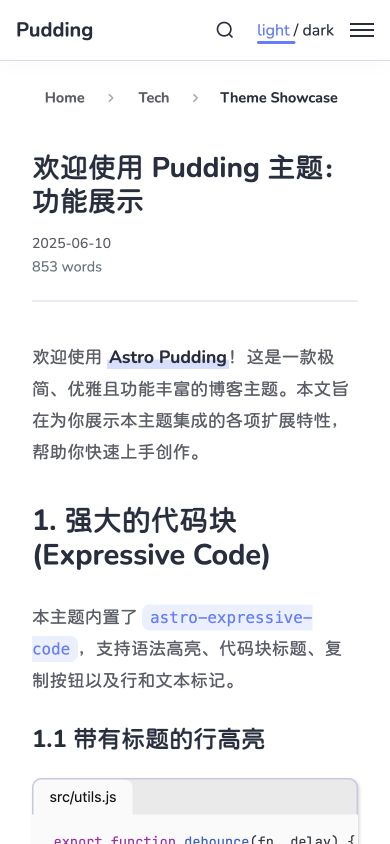

# Astro Theme Pudding

[English](README.md) · [示例站点](https://huamurui.github.io/pudding/)

Pudding 是基于 Astro 7 和 Svelte 5 的静态 Markdown 博客主题，提供亮暗主题、响应式文章列表、时间线、搜索、目录导航、标签页、反向链接、悬停预览、图片缩放、数学公式与 Expressive Code。构建时会生成 RSS、站点地图和结构化元数据，也可以启用 giscus 评论。

## 页面预览

截图来自本仓库的演示内容，同一首页左上为亮色主题，右下为暗色主题，分割线略向逆时针倾斜。


<details>
<summary>桌面首页、暗色文章与移动端布局</summary>




</details>

## 快速开始

使用 **Node.js 22.12.0 或更新版本**和 **pnpm 12.8.1**。仓库中的 `.nvmrc` 选择 Node 22，`packageManager` 固定 pnpm 版本。

```sh
git clone https://github.com/huamurui/pudding.git
cd pudding
# 使用 nvm 时可运行：nvm install && nvm use
npm install --global pnpm@12.8.1
pnpm install --frozen-lockfile
pnpm dev
```

默认配置的本地地址是 `http://localhost:4321/pudding/`。发布前，先修改站点配置，再替换示例文章、关于页面和友链。

| 命令 | 用途 |
| --- | --- |
| `pnpm generate` | 根据已发布 Markdown 文章生成 `.cache/backlinks.json`。 |
| `pnpm dev` | 生成反向链接并启动开发服务器。 |
| `pnpm check` | 生成反向链接，然后检查 Astro 和 Svelte 类型。 |
| `pnpm test` | 运行回归测试。 |
| `pnpm lint` | 使用 ESLint 检查源码。 |
| `pnpm lint:fix` | 应用 ESLint 可自动修复的修改。 |
| `pnpm build` | 生成反向链接，将静态站点构建到 `dist/`。 |
| `pnpm preview` | 在本地预览已有的生产构建。 |
| `pnpm build:infos` | `pnpm build` 的别名。 |

开发中修改文章链接后，运行 `pnpm generate` 并重启开发服务器，以刷新反向链接。`pnpm preview` 需要先完成构建，它不会重新构建站点。

## 站点配置

编辑 `src/config/site.config.ts`，保留现有对象结构并修改字段：站点名称、描述、作者、导航、社交链接、主题颜色、界面语言和评论。

| 字段 | 作用 | 项目 Pages 示例 |
| --- | --- | --- |
| `site` | 传给 Astro 的公开站点源地址，用于生成绝对 URL。 | `https://YOUR_USER.github.io` |
| `base` | 本地路由与资源的路径前缀；部署在域名根目录时填 `''`。 | `/pudding` |
| `url` | 完整公开站点地址；RSS 优先使用 Astro 和配置中的 `site`，最后才使用它作为兼容后备地址。 | `https://YOUR_USER.github.io/pudding/` |

GitHub 仓库名为 `pudding` 时：

```ts
site: 'https://YOUR_USER.github.io',
base: '/pudding',
url: 'https://YOUR_USER.github.io/pudding/',
```

用户站点（仓库名为 `YOUR_USER.github.io`）或部署在自定义域名根目录时：

```ts
site: 'https://YOUR_USER.github.io',
base: '',
url: 'https://YOUR_USER.github.io/',
```

使用自定义域名时，将相应字段中的域名替换为自己的域名；重命名仓库时也要更新 `base` 和 `url`。不要在 `site` 与 `base` 中重复填写 `/pudding`。

配置中的 `./about`、`/rss.xml`、`./sitemap.xml` 会经过主题的 URL 工具函数添加部署前缀。修改 Astro/Svelte 组件时，使用 `src/utils/helpers.ts` 中的 `buildUrl`、`getPostUrl` 和 `getTagUrl`。Markdown 中的原始 HTML 链接按原样使用，因此 `/images/example.png` 始终指向域名根目录，即使 `base` 是 `/pudding`。

通过 `locale` 选择 `en-US` 或 `zh-CN`。界面翻译文本位于 `src/config/i18n.config.ts`，该设置不会改变文章语言。

## 写文章

将 `.md` 文件放在 `src/posts/` 中。本主题未配置 MDX。只有 `title` 和 `date` 必填：

```yaml
---
title: "第一篇文章"
date: "2026-01-01T09:00:00+08:00"
description: "用于元数据和 RSS 的简短描述。"
tags: ["Astro", "C++/C#", "中文"]
author: "Your Name"
updated: "2026-01-02T10:30:00+08:00"
pinned: false
draft: false
slug: "notes/my-first-post"
image:
  url: "https://images.unsplash.com/photo-1579546929518-9e396f3cc809?w=1200&q=80"
  alt: "彩色渐变"
---
```

| 字段 | 行为 |
| --- | --- |
| `title` | 必填，非空标题。 |
| `date` | 必填，支持日期或日期时间。`2026-01-01` 有效；日期时间建议加引号并明确时区。排序使用完整时间戳，页面显示其 UTC 日期。 |
| `description` | 可选纯文本描述，缺省时元数据与 RSS 使用摘要；首页卡片使用正文中的富文本摘要。 |
| `tags` | 可选列表。标签会去除首尾空白、统一 Unicode 形式并去重，空标签无效。 |
| `author` | 可选，覆盖文章元数据中的作者。 |
| `updated` | 可选，用于结构化元数据的修改日期。 |
| `pinned` | 默认为 `false`，置顶文章优先显示在首页。 |
| `draft` | 默认为 `false`。草稿不会生成公开页面，也不会进入列表、搜索、标签、订阅源、预览和反向链接。 |
| `slug` | 可选，覆盖文章 ID；路径规则见下文。 |
| `image` | 可选封面图，包含绝对 URL 和可选 `alt`，后者也会显示为封面说明。Astro 封面图片管线使用的远程域名需在 `astro.config.mjs` 中放行。 |
| `url` | 可选 canonical 地址。转载时可填写绝对 HTTP(S) 地址，不会改变本地文章路由。 |

将 `<!-- more -->` 放在希望展示于首页卡片的正文之后。没有标记时，首页摘要使用第一段文字或列表。

### 文章路径、目录与标签

`src/posts/tech/my-post.md` 的 ID 是 `tech/my-post`，默认部署前缀下的地址为 `/pudding/posts/tech/my-post/`。默认路径段采用 GitHub 风格生成 slug。嵌套的 `index.md` 代表所在目录，例如 `tech/index.md` 对应 ID `tech`；根目录的 `index.md` 保留 ID `index`。

`slug` 覆盖整个 ID，包括目录部分。使用 `guides/getting-started` 这样的非空相对路径，建议各段采用小写字母、数字、Unicode 或连字符。避免首尾斜线、空路径段、`.`、`..`、反斜线、URL 协议、百分号编码的分隔符以及 `?`、`#`。主题保留 Astro 原生的自定义 slug 行为，不会自动修正无效路径。重复 ID 会导致反向链接生成失败，包括默认 slug 转换或自定义 slug 导致的冲突。

主题自动生成每层目录的文章列表，支持嵌套目录。文章占用了目录地址时，该地址优先显示文章，菜单仍保留子项。例如 `tech/index.md` 可与 `tech/tools/editor.md` 共存：`/posts/tech/` 展示目录首页文章，`/posts/tech/tools/` 展示后代文章列表。`tech.md` 与 `tech/index.md` 不能共存，因为 ID 都是 `tech`。

标签可包含 Unicode 以及 `+`、`/`、`#`、`%`、`?` 等字符。主题会生成安全且彼此独立的标签 URL，同时保留显示名称。使用 `getTagUrl` 生成链接，不要直接将标签名称拼入 URL。

### 文章链接与预览

使用相对于**源 Markdown 文件**的路径，建议保留 `.md` 后缀。例如在 `src/posts/tech/` 的文章中：

```md
[功能展示](./theme-showcase.md)
[数学示例](./math-and-katex.md#math-examples)
[Markdown 扩展](./plugins-and-extensions.md)
```

已知文章链接会改写到正确的部署路径，也支持自定义 slug。可以使用无扩展名路径、目录 `index.md`、查询参数、锚点和引用式链接。指向已知草稿的链接会变为普通文字；未知目标与资源链接保持原样。标题锚点遵循 Markdown 标题的 slug 规则。

已发布文章的站内链接支持悬停预览。预览和首页摘要保留富文本格式，同时移除脚本、事件处理属性与交互嵌入；使用交互内容需要打开完整文章。反向链接由已发布文章的 Markdown 链接生成，自引用不会产生反向链接。

## Markdown 扩展

### 代码与数学公式

Expressive Code 提供语法高亮、编辑器/终端框、复制按钮、标题、行与文本标记：

````md
```js title="hello.js" {2}
const name = 'Pudding'
console.log(`Hello, ${name}!`)
```
````

行号与折叠区块需要额外安装 Expressive Code 插件，本模板未启用。更多语法见 [标记文档](https://expressive-code.com/key-features/text-markers/)。

行内公式使用 `$E = mc^2$`，独立公式块在上下各放一行 `$$`。公式由 `remark-math` 与 KaTeX 渲染。

### 防剧透文字

```md
这是 ||模糊文字||，这是 |||黑色遮盖文字|||。
```

两种形式都用于行内纯文本，可以点击或用 Enter、空格键揭示。将一对分隔符放在同一个文本片段中，不支持嵌套 Markdown 格式或内部的竖线字符。

### 链接卡片

独立段落中仅包含一个 HTTP(S) Markdown 链接或纯 URL 时，可以生成链接卡片：

```md
[Astro](https://astro.build/)

https://github.com/huamurui/pudding
```

前后留空行。句子中的链接仍作为普通链接显示。元数据在开发/构建时获取，缓存在 `.cache/link-previews.json`。目标不可用或没有合适元数据时保留原始链接，请求失败不会阻止构建。删除该缓存文件可以刷新元数据。

### 图片

Markdown 图片支持延迟加载和点击缩放。远程 Markdown 图片作为普通图片元素输出，不会下载后交给 Astro 变换；封面图使用 Astro 图片管线。正文图片的 alt 不会自动生成图片说明，需要另写说明段落，或使用可信的 HTML `<figure>` / `<figcaption>`。

### 交互文章

完整文章允许**可信作者**编写原始 HTML 和脚本。导入外部 Markdown 前应先审阅，文章渲染不能作为不可信 HTML 的隔离环境。

主题采用 Astro 客户端路由。需要每次进入页面都初始化的行内脚本使用原生 `data-astro-rerun`，并采用 IIFE 或 `type="module"`，避免重复声明全局变量。页面切换前应清理监听器、定时器与观察器：

```html
<button type="button" data-demo-counter>Count: 0</button>
<script data-astro-rerun>
  (() => {
    const button = document.querySelector('[data-demo-counter]')
    if (!button) return
    const controller = new AbortController()
    let count = 0
    button.addEventListener('click', () => {
      button.textContent = `Count: ${++count}`
    }, { signal: controller.signal })
    document.addEventListener('astro:before-swap', () => {
      controller.abort()
    }, { once: true, signal: controller.signal })
  })()
</script>
```

这里使用 Astro 原生脚本生命周期，无需自定义重执行属性。悬停预览和首页摘要会移除交互脚本。

## 评论

评论默认关闭。选择一个公开 GitHub 仓库，开启 Discussions 并安装 giscus app，然后在 [giscus.app](https://giscus.app/zh-CN) 生成仓库与分类 ID。将值填入 `siteConfig.giscus`，再设置 `enabled: true`。

`strict`、`reactionsEnabled` 和 `emitMetadata` 保留生成的字符串值。`lang` 指定评论语言。`mapping: 'pathname'` 按完整部署路径关联讨论，包括部署前缀，因此修改 slug 或 `base` 可能改变讨论映射。评论组件进入可视区域后加载，并跟随站点亮暗主题。

## 部署到 GitHub Pages

1. 从主题创建自己的仓库，将代码推送到 `main`。
2. 根据账号与仓库名配置 `site`、`base` 和 `url`。
3. 在 **Settings → Pages → Build and deployment** 中，将来源设置为 **GitHub Actions**。
4. 推送到 `main`，或从 `main` 手动运行仓库内的工作流。

`.github/workflows/` 中的工作流对发往 `main` 的 PR 和推送运行 lint、类型检查、测试与生产构建。部署只在非 PR 的 `main` 上执行。质量检查从 `packageManager` 读取 pnpm，从 `.nvmrc` 读取 Node；Astro 构建使用 Node 22。采用其他默认分支时，同时修改触发分支与部署条件。自定义域名配置见 [GitHub 官方指南](https://docs.github.com/en/pages/configuring-a-custom-domain-for-your-github-pages-site)。

其他静态托管服务可以发布 `pnpm build` 生成的 `dist/`。构建采用目录形式路由并保留末尾斜线。RSS、站点地图和 robots 规则分别位于 `/rss.xml`、`/sitemap.xml`、`/robots.txt`，均带有配置中的部署前缀。

## 项目结构

```text
src/config/         站点设置与界面翻译
src/posts/          Markdown 文章；tech/ 中为功能样例
src/pages/          页面路由、订阅源、搜索数据和预览端点
src/components/     Astro 与 Svelte 界面组件
src/layouts/        通用页面布局
src/plugin/         Markdown 变换
src/scripts/        浏览器行为与页面切换生命周期
src/utils/          内容、URL、摘要与元数据工具
src/data/links.json  友链数据
scripts/            反向链接生成与文章源路径解析
tests/              回归测试
public/             静态资源、字体与订阅源样式
.github/workflows/  GitHub Pages 质量检查与部署
```

`dist/`、`.astro/`、`.cache/` 和 `node_modules/` 为生成内容，已由 Git 忽略。保留提交 `pnpm-lock.yaml`。缓存可以删除并按需重建，不是文章源文件。

## 许可证与致谢

[MIT](LICENSE)。基于 [Astro](https://astro.build/) 与 [Svelte](https://svelte.dev/) 构建，代码渲染由 [Expressive Code](https://expressive-code.com/) 提供。设计参考包括 [fuwari](https://github.com/saicaca/fuwari)。
